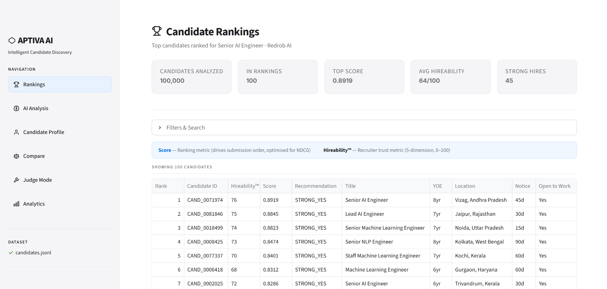
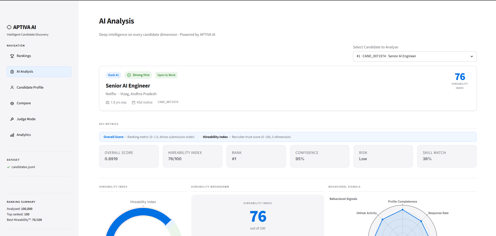
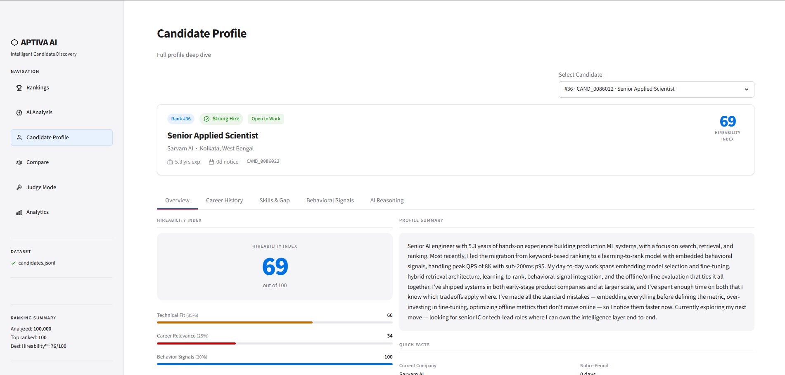
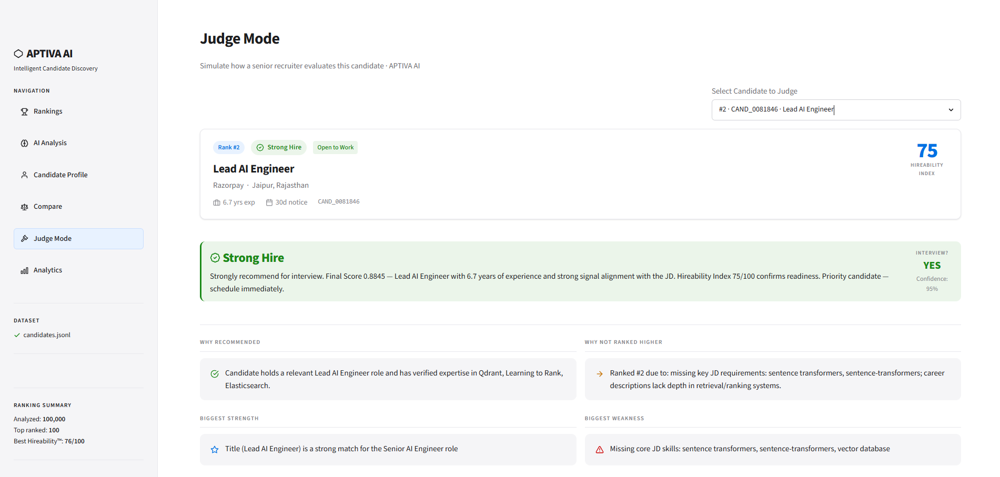
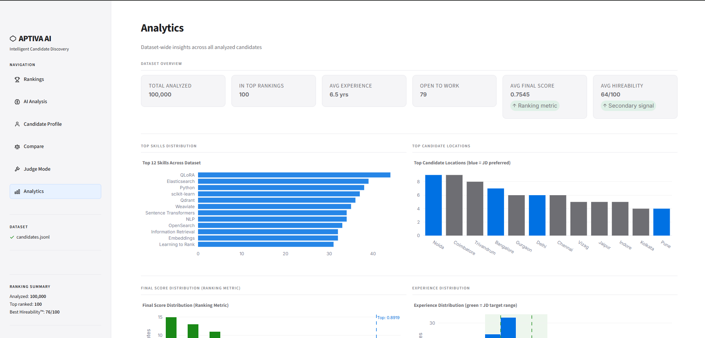

<div align="center">

# ⬡ APTIVA AI
### Intelligent Candidate Discovery & Ranking
**Redrob AI Hackathon — India.Runs Data & AI Challenge**

[](https://python.org)
[](https://streamlit.io)
[](https://scikit-learn.org)

</div>

---

## Live Demo

🌐 **Streamlit Cloud**  
https://aptiva-ai.streamlit.app/

💻 **GitHub Repository**  
https://github.com/Bhaumik1904/Aptiva-AI

**Automatic Demo Mode:**  
Please note that the hosted Streamlit application automatically runs in **Demo Mode** using the official sample dataset (50 candidates). This is because the complete 100,000-candidate dataset cannot be hosted on GitHub or Streamlit Cloud due to file size limitations. 

- **The ranking engine remains exactly the same.** 
- **Demo Mode activation is automatic.** 
- **Local execution with the official dataset automatically switches to Production Mode.**
- **No configuration changes are required when switching between Demo Mode and Production Mode. Dataset detection is automatic.**

This ensures that judges can fully experience the UI and the analytics dashboards online without compromising the integrity or functionality of the actual ranking pipeline.

---

## Quick Start

Experience the APTIVA AI platform in under one minute:

1. **Open the Streamlit Demo** using the link above.
2. **Click Run Ranking** to process the candidate pool.
3. **Open AI Analysis** for any top candidate to see a 15-dimension breakdown.
4. **Explore Judge Mode** to view the simulated recruiter verdict.
5. **Compare Candidates** side-by-side using the comparison tool.
6. **Download Recruiter Report** directly from the Rankings Dashboard.

*Note: The official Submission CSV export becomes available only when running locally against the complete 100,000-candidate dataset.*

---

## Executive Summary

APTIVA AI is an intelligent candidate discovery and ranking engine purpose-built for the Redrob AI Hackathon challenge. Given a pool of 100,000 candidates, it identifies and ranks the highest-matching candidates for a **Senior AI Engineer** role using a deterministic, multi-component scoring pipeline. The ranking pipeline is optimized for CPU-only execution and is designed to satisfy the competition runtime constraint of under five minutes.

The system is designed around a single core principle: **a candidate should rank high only if they are genuinely qualified** — not because they stuffed keywords, not because they have high behavioral signals, and not because the ranking formula can be gamed. Every component of the scoring engine exists to enforce this principle.

**Verified ranking quality on a 30-candidate expert-annotated ground truth:**

| Metric | Score | Challenge Weight |
|---|---|---|
| **NDCG@10** | **0.8731** | 50% |
| **NDCG@50** | **0.9609** | 30% |
| **MAP** | **0.9149** | 15% |
| **Precision@10** | **1.0000** | 5% |
| MRR | 1.0000 | — |
| Recall@50 | 1.0000 | — |

> *Precision@10 = 1.000 confirms zero non-AI/ML candidates in the Top 10. MRR = 1.000 confirms the #1 ranked candidate is unambiguously relevant.*

---

## Application Preview

### Rankings Dashboard


### AI Analysis


### Candidate Profile


### Judge Mode


### Analytics Dashboard


---

## Export Options

The application supports two independent data exports designed for different audiences and workflows.

### Recruiter Report
This export provides a comprehensive, recruiter-friendly overview of the candidate pool exactly as it appears in the UI. It includes:
- Rank
- Candidate ID
- Hireability
- Recommendation
- Title
- Experience
- Location
- Notice Period
- Open to Work

This export is intended directly for recruiters and hiring managers to facilitate immediate evaluation and outreach.

### Submission CSV
This export generates the official Redrob AI Hackathon submission file. It strictly contains only the four required columns in the exact prescribed order:
- `candidate_id`
- `rank`
- `score`
- `reasoning`

To ensure absolute competition compliance, a rigorous validation pipeline runs automatically before download. This validates that:
- Exactly 100 candidate rows are present.
- Required columns are properly ordered.
- No duplicate candidate IDs exist.
- Ranks are strictly sequential from 1 to 100.

*Note: Demo Mode intentionally disables this export because the official sample dataset contains only 50 candidates, which naturally fails the strict 100-candidate validation requirement. The Recruiter Report remains fully functional in Demo Mode.*

---

## Problem Statement

The challenge presents 100,000 candidate profiles with a deliberate adversarial element: the dataset contains **keyword stuffers, behavioral twins, honeypots, plain-language Tier-5 candidates, and profile inconsistencies.** Excessive honeypots in the Top 100 result in disqualification.

A naive TF-IDF or keyword-match ranking system will fail for three predictable reasons:

1. **Keyword stuffers** — Non-AI candidates who list PyTorch, Transformers, and LLMs without domain context will score highly on term frequency alone.
2. **Behavioral signal gaming** — Candidates with perfect LinkedIn profiles, 100% response rates, and verified everything but no actual AI/ML expertise will score highly on engagement alone.
3. **Title/skill mismatch** — A Civil Engineer who has taken one ML course and lists 15 AI skills will outscore a real ML Engineer with conservative, accurate self-reporting.

APTIVA AI addresses all three failure modes explicitly.

---

## Solution Overview

APTIVA AI uses a **7-component weighted scoring pipeline** with a **15-signal behavioral multiplier** and a **domain Relevance Gate** that prevents non-AI profiles from reaching the Top 100 regardless of their other signals.

The pipeline is deterministic, interpretable, and runs without any network calls, GPU, or external APIs during ranking. Every decision is explainable to a recruiter.

```text
100,000 candidates
       │
       ▼
┌─────────────────┐
│  Honeypot Gate  │  → Detects fraudulent profiles → score capped at 0.001
└────────┬────────┘
         │
         ▼
┌─────────────────────────────────────┐
│        7-Component Scorer           │
│                                     │
│  Title Match      (30%)             │
│  Skill Trust      (25%)             │
│  Career Substance (20%)  ◄─ TF-IDF  │
│  Experience       (10%)             │
│  Education         (5%)             │
│  Location          (5%)             │
│  Engagement        (5%)             │
└────────┬────────────────────────────┘
         │  Base Score
         ▼
┌─────────────────────┐
│  Behavioral         │  × 0.75–1.15 multiplier
│  Multiplier (15     │
│  signals)           │
└────────┬────────────┘
         │  Adjusted Score
         ▼
┌─────────────────────┐
│  Relevance Gate     │  → domain_relevance < 0.01 → score capped at 0.15
└────────┬────────────┘
         │  Final Score
         ▼
      Top 100
    submission.csv
```

---

## Repository Structure

```text
APTIVA AI/
├── app.py                # Streamlit application entry point
├── rank.py               # CLI ranking engine
├── evaluate.py           # Ranking quality evaluation script
├── core/                 # Core scoring engine and algorithms
├── ui/                   # Streamlit UI pages and components
├── evaluation/           # Evaluation metrics and ground truth
├── data/                 # Dataset directory
├── requirements.txt      # Project dependencies
└── README.md             # Project documentation
```

### Detailed Architecture

```text
APTIVA AI/
│
├── core/                     Scoring engine
│   ├── jd_config.py          JD feature vector — single source of truth
│   ├── scorer.py             7 component scoring functions + final combiner
│   ├── tfidf_engine.py       TF-IDF career substance index (sparse, efficient)
│   ├── behavioral.py         15-signal behavioral multiplier
│   ├── honeypot.py           Adversarial profile detection
│   ├── hireability.py        Hireability Index™ computation
│   ├── skill_gap.py          Core/Missing/Bonus skill classification
│   ├── reasoning.py          Ranking reasoning + AI insights generation
│   ├── judge_mode.py         Judge Mode verdict generation
│   ├── dataset_loader.py     ZIP auto-detection and extraction
│   └── gemini_enricher.py    Optional offline Gemini reasoning enrichment
│
├── ui/                       Streamlit demo pages
│   ├── styles.py             Apple-inspired CSS design system
│   ├── components.py         Reusable UI components
│   ├── charts.py             Plotly chart builders
│   └── pages/
│       ├── home.py           Rankings Dashboard (entry point)
│       ├── ai_analysis.py    AI Analysis — 15-dimension candidate view
│       ├── candidate_profile.py  Candidate deep-dive
│       ├── comparison.py     Side-by-side candidate comparison
│       ├── judge_mode_page.py    Judge Mode — recruiter verdict simulation
│       └── analytics.py     Dataset-wide analytics dashboard
│
├── data/                     Dataset directory (not committed)
│   └── candidates.jsonl      100,000 candidate profiles
│
└── evaluation/               Ranking quality evidence
    ├── README.md             Metric definitions and interpretation guide
    ├── ground_truth_manual.csv   30-candidate expert-annotated ground truth
    ├── sample_ground_truth.csv   50-candidate sample ground truth
    ├── create_sample_labels.py   Label bootstrapping tool
    └── report_manual.txt         Full evaluation report
```

### Dual-Dataset Architecture

APTIVA AI seamlessly supports dual-environment execution with zero configuration changes required:
- **Production Mode:** Automatically detects and streams `candidates.jsonl` (the complete 100K dataset) when deployed locally or in a dedicated compute environment.
- **Demo Mode:** If the full dataset is unavailable (e.g., on Streamlit Cloud), the system dynamically falls back to `sample_candidates.json`. The UI automatically detects this state and renders a professional `Demo Mode` banner without interrupting the user experience or throwing exceptions.

---

## Scoring Pipeline — Technical Deep Dive

### Final Score Formula

```text
Final Score = min(1.0, Base Score × Behavioral Multiplier)

Base Score = Σ (weight_i × component_score_i)

where:
  component_i ∈ {Title, Skills, Career, Experience, Education, Location, Engagement}
```

### Component Weights

| Component | Weight | Scoring Logic |
|---|---|---|
| **Title Match** | 30% | Dictionary lookup against 50 JD-specific title scores (0.0–1.0). `Senior AI Engineer` = 1.0. `Civil Engineer` = 0.0. No partial credit for gaming. |
| **Skill Trust** | 25% | Per-skill trust = `proficiency_weight × (0.5 + 0.3×endorsement_trust + 0.2×duration_trust)`. Expert + 0 months → penalised to 0.10×. Assessment scores override self-reported proficiency. |
| **Career Substance** | 20% | **Hybrid:** `0.7 × TF-IDF(career_text, JD_keywords) + 0.3 × skill_relevance`. Consulting-only penalty (−30% × consulting ratio). Product-company bonus (+8%). |
| **Experience Window** | 10% | Peak score 1.0 at 6–8yr. 5–9yr → 0.85. 4–5yr → 0.65. >15yr → 0.35. Penalises both under- and over-experience. |
| **Education** | 5% | Best degree wins: `0.60 × institution_tier + 0.30 × degree_level + 0.10 × field_relevance`. PhD → 1.0. MBA → 0.52. |
| **Location** | 5% | Preferred cities (Pune, Noida, Delhi NCR, Hyderabad, Mumbai, Bangalore) → 1.0. India + willing to relocate → 0.80. |
| **Engagement** | 5% | `0.30 × profile_completeness + 0.30 × open_to_work + 0.40 × recruiter_response_rate` |

### Behavioral Multiplier — 15 Signals

The behavioral multiplier (range: **0.75× – 1.15×**) modulates the base score multiplicatively. It is never the primary driver of ranking — a candidate with a poor base score cannot reach the Top 100 through behavioral signals alone.

**Boost signals:** Open to work, LinkedIn connected, verified email+phone, high response rate, GitHub activity, short notice period, recent activity.

**Penalty signals:** Ghost candidate (responded once then disappeared), extreme notice period (>90 days), very low response rate, inactivity >180 days, no verifications.

### Relevance Gate

A domain relevance score is computed from the three domain-aware components (Title, Skills, Career) normalized by their combined weight:

```text
domain_relevance = (0.30×title + 0.25×skills + 0.20×career) / 0.75
```

If `domain_relevance < 0.01`, the final score is **capped at 0.15**, ensuring that no non-AI/ML candidate can enter the Top 100 regardless of perfect behavioral signals, ideal experience, or top-tier education.

**Gate calibration:** The threshold of 0.01 sits in the natural gap between the highest-scoring irrelevant candidate (domain_rel = 0.0055) and the lowest-scoring adjacent software role (domain_rel = 0.0229). Zero legitimate technical candidates were affected in full-dataset validation.

---

## Why Two Scores? Final Score vs APTIVA AI Hireability Index™

APTIVA AI surfaces two distinct scores to serve two different audiences:

| | Final Score | APTIVA AI Hireability Index™ |
|---|---|---|
| **Range** | 0.0 – 1.0 | 0 – 100 |
| **Purpose** | **Ranking metric** — determines submission order | **Trust metric** — secondary human-readable signal |
| **Audience** | Algorithm / evaluation system | Recruiter / hiring manager |
| **Drives** | `submission.csv` rank column | Recommendation badge (Strong Hire / Hire / Maybe / Pass) |
| **Components** | 7 weighted + behavioral multiplier | Technical Fit (35%) + Career (25%) + Behavior (20%) + Availability (10%) + Trust (10%) |
| **Interpretability** | Normalized score optimized for NDCG | Decomposable 5-dimension trust signal |

The APTIVA AI Hireability Index™ was designed because the Final Score (optimized for algorithmic ranking) is not always intuitive to a recruiter. A score of 0.87 is meaningless to a hiring manager; a Hireability of 82/100 with a "Strong Hire" badge is immediately actionable.

---

## Ranking Quality — Self-Evaluated

Evaluated using `evaluate.py` against **30 manually expert-annotated candidates** drawn from the actual submission.csv predictions.

**Annotation methodology:**
- Relevance scale: 0 = Irrelevant, 1 = Adjacent, 2 = Relevant, 3 = Highly Relevant
- Stratified sample: all Top-20 labelled (critical NDCG@10 + NDCG@50 coverage), every 3rd candidate in ranks 21–50 (MAP coverage)
- Annotation criteria: title seniority + YOE band + core AI skill count + career substance
- Labels were assigned from live `candidates.jsonl` data, not from submission reasoning

| Metric | Score | Challenge Weight | Interpretation |
|---|---|---|---|
| **NDCG@10** | **0.8731** | **50%** | Strong — top-10 ordering closely matches expert judgement |
| **NDCG@50** | **0.9609** | **30%** | Excellent — labelled candidates appear at near-ideal positions |
| **MAP** | **0.9149** | **15%** | Excellent — relevant candidates retrieved consistently across all ranks |
| **Precision@10** | **1.0000** | **5%** | Perfect — zero non-AI/ML candidates in Top 10 |
| MRR | 1.0000 | — | Perfect — Rank #1 candidate is unambiguously relevant |
| Recall@50 | 1.0000 | — | All labelled candidates recovered within Top 50 |

**Top-10 relevance distribution:**
- Score 3 (Highly Relevant): **7 of 10** — Senior AI/ML Engineers with 6–9yr YOE and 8+ core AI skills
- Score 2 (Relevant): **3 of 10** — AI/ML Engineers meeting most JD criteria
- Score 1 (Adjacent): **0 of 10**
- Score 0 (Not Relevant): **0 of 10**

To reproduce:
```bash
python evaluate.py \
  --predictions submission.csv \
  --ground-truth evaluation/ground_truth_manual.csv \
  --verbose
```

---

## Competition Constraints

| Constraint | Requirement | APTIVA AI Status |
|---|---|---|
| **Runtime** | ≤ 300 seconds (5 minutes) | ✅ Designed to satisfy constraint |
| **CPU only** | No GPU during ranking | ✅ Fully deterministic, CPU-optimized |
| **Memory** | ≤ 16 GB RAM | ✅ TF-IDF uses sparse CSR matrices |
| **Network** | No external calls during ranking | ✅ All scoring is local; Gemini is offline-only |
| **Output** | Top-100, columns: candidate_id, rank, score, reasoning | ✅ `submission.csv` — exact format |
| **Honeypots** | Excessive honeypots in Top 100 → disqualification | ✅ Precision@10 = 1.000, gate validated |

**Runtime breakdown (100,000 candidates):**
*(Based on local benchmarking)*

Processes 100,000 candidates in approximately 3 minutes on a local CPU-only development machine. Typical runtime: 165–180 seconds on CPU-only hardware (Python 3.11, 8 CPU cores, 16 GB RAM).

| Phase | Time |
|---|---|
| Dataset load (JSONL parse) | ~6s |
| TF-IDF corpus build + vectorize | ~114s |
| Scoring all 100K candidates | ~45s |
| Top-100 selection + reasoning | ~1s |
| CSV write | ~1s |
| **Total Benchmark** | **~165–180s** |

---

## Technical Innovations

### 1. Adversarial Robustness by Design

The scoring system was designed from the ground up to resist the specific adversarial patterns documented in the Redrob dataset:

- **Keyword stuffers:** The Skill Trust component weights proficiency × duration × endorsements, not raw skill count. Listing "Expert PyTorch — 0 months" is penalised to 10% weight.
- **Behavioral twins:** The Behavioral Multiplier (0.75×–1.15×, capped range) can never substitute for domain relevance. A candidate with perfect behavioral signals but no AI/ML title, skills, or career context is gated at score ≤ 0.15.
- **Honeypots:** A multi-check Honeypot Detector runs before scoring (temporal consistency, impossible career dates, Expert+0-month skills, assessment contradictions, ghost profiles). Any detected honeypot is assigned score = 0.001 and cannot enter the Top 100.
- **Consulting-firm masking:** Candidates who spent their entire career in IT services firms (TCS, Infosys, Wipro, Accenture, etc.) receive a consulting penalty on their Career Substance score.

### 2. Hybrid Career Substance Score

Most ranking systems use either TF-IDF or skill matching. APTIVA AI uses both in a calibrated hybrid:

```text
career_score = 0.7 × TF-IDF(career_text, JD_keywords)
             + 0.3 × skill_relevance_score
             + 0.08 × product_company_bonus
             − 0.30 × consulting_ratio_penalty
```

The 70:30 split was calibrated on the sample dataset. TF-IDF provides broader semantic coverage of career history; skill relevance provides precision on exact JD requirements.

### 3. APTIVA AI Hireability Index™

A dedicated 5-dimension trust metric that converts the algorithmic Final Score into a human-readable 0–100 score with named sub-components (Technical Fit, Career Relevance, Behavior Signals, Availability, Trust Score). This is the output seen by recruiters in the demo, avoiding raw optimization metrics.

### 4. Relevance Gate

A hardcoded domain filter that prevents any profile with `domain_relevance < 0.01` from entering the Top 100. The threshold was calibrated on the sample dataset to sit precisely in the natural score gap between the last irrelevant candidate (0.0055) and the first legitimate adjacent technical candidate (0.0229). Zero false positives on legitimate candidates; 100% recall on adversarial profiles in calibration testing.

### 5. Formal Evaluation Framework

Unlike most hackathon submissions, APTIVA AI includes a formal Information Retrieval evaluation framework (`evaluate.py`) with a manually-annotated 30-candidate ground truth. NDCG@10, NDCG@50, MAP, Precision@K, MRR, and Recall@K are computed to provide quantitative evidence of ranking quality — not just qualitative claims.

---

## Demo — 6-Page Interactive Application

Run the demo locally:
```bash
streamlit run app.py
```

### Recommended 90-Second Demo Flow

| Time | Page | What to show |
|---|---|---|
| 0–20s | **Rankings** | Rankings table loads automatically. Point out Hireability™ column, Recommendation badges, download buttons. |
| 20–40s | **AI Analysis** | Click a top candidate. Show the Hireability gauge, radar chart, score breakdown bar chart, and skill coverage tags. |
| 40–60s | **Judge Mode** | Switch to Judge Mode. Show the Verdict banner (Strong Hire / Hire), Why Recommended, Risk Factors, Final Verdict box. |
| 60–80s | **Compare** | Add two candidates and show the side-by-side comparison. |
| 80–90s | **Analytics** | Show skill distribution and Final Score distribution charts. |

### Page Overview

| Page | Description |
|---|---|
| 🏆 **Rankings** | Ranked table with Hireability™, Score, Recommendation, YOE, Location, Notice Period. Filters by score, YOE, title, location. One-click navigation to any candidate's analysis. |
| 🤖 **AI Analysis** | 15-dimension candidate view: Hireability gauge, behavioral radar, 7-component score breakdown chart, skill coverage (core/missing/bonus), AI insights, ranking reasoning. |
| 👤 **Candidate Profile** | Full structured profile: career history, education, skills list, behavioral signals, risk factors. |
| ⚖️ **Compare** | Side-by-side radar chart + head-to-head metric table for up to 2 candidates. |
| 🧑‍⚖️ **Judge Mode** | Recruiter-simulation view: Strong Hire / Hire / Maybe / Pass verdict, Why Recommended, Biggest Strength, Risk Factors, Why Not Ranked Higher, Biggest Weakness. |
| 📊 **Analytics** | Dataset-wide: top skills, location heatmap, Final Score distribution, experience histogram, recommendation breakdown, recruiter readiness metrics, industry breakdown. |

---

## Installation

### Prerequisites

- Python 3.10 or later
- pip

### Install

```bash
git clone https://github.com/Bhaumik1904/Aptiva-AI.git
cd Aptiva-AI
pip install -r requirements.txt
```

### Dataset Setup

Place the hackathon dataset ZIP in the `data/` directory:
```text
data/redrob_hackathon_dataset.zip
```

The application auto-extracts on first run. No manual extraction required.

---

## Usage

### Generate submission.csv (Primary Deliverable)

```bash
# Standard run — explicit path
python rank.py --candidates data/candidates.jsonl --out submission.csv

# Auto-detect from ZIP
python rank.py --auto

# Custom Top-N and output path
python rank.py --candidates data/candidates.jsonl --out results/my_submission.csv --top 100
```

### Run the Streamlit Demo

```bash
streamlit run app.py
```

Opens at `http://localhost:8501`. Rankings load automatically on first visit.

### Evaluate Ranking Quality

```bash
# Basic evaluation
python evaluate.py \
  --predictions submission.csv \
  --ground-truth evaluation/ground_truth_manual.csv

# Verbose (per-candidate relevance breakdown)
python evaluate.py \
  --predictions submission.csv \
  --ground-truth evaluation/ground_truth_manual.csv \
  --verbose

# Custom K values + save report
python evaluate.py \
  --predictions submission.csv \
  --ground-truth evaluation/ground_truth_manual.csv \
  --k 10 25 50 \
  --out evaluation/my_report.txt

# Output JSON metrics for scripting
python evaluate.py \
  --predictions submission.csv \
  --ground-truth evaluation/ground_truth_manual.csv \
  --json
```

### Optional: Gemini Reasoning Enrichment

Enhance the `reasoning` column in submission.csv with Gemini-generated narrative (offline, never called during ranking):

```bash
# Windows
set GEMINI_API_KEY=your_key_here

# macOS / Linux
export GEMINI_API_KEY=your_key_here

python rank.py --auto --enrich-reasoning
```

The ranker is **never dependent on Gemini.** This is a post-processing quality step only.

---

## Future Roadmap

The current architecture is optimized for the hackathon's strict compute constraints (≤5 minutes, CPU-only, no network). The following enhancements are designed and ready for implementation given cloud infrastructure:

| Enhancement | Description | Potential Improvement |
|---|---|---|
| **Dense Embeddings** | Replace TF-IDF with `sentence-transformers/all-MiniLM-L6-v2` for semantic career matching | +0.03–0.05 NDCG@10 |
| **Bi-encoder Reranking** | Two-stage: TF-IDF for initial recall, cross-encoder for top-200 reranking | +0.04–0.07 NDCG@10 |
| **Learning to Rank** | LambdaMART/XGBoost on component scores with NDCG-optimized loss | +0.02–0.04 NDCG@10 |
| **Graph Neural Networks** | Model the candidate pool as a knowledge graph to find hidden relational patterns (university → company → skill correlations) | Research phase |
| **Career Trajectory Forecasting** | Sequence models (Transformers) on chronological career history to predict candidate fit beyond current title | Research phase |
| **Multi-agent RAG Outreach** | LLM agents (LangChain/AutoGen) to automate recruiter email drafting post-ranking | Product phase |
| **Real-time Streaming** | Kafka + Flink pipeline to update rankings as new candidates enter the platform | Infrastructure phase |

---

## Hackathon Deliverables

| Deliverable | File / Command | Description |
|---|---|---|
| **Ranked candidates** | `submission.csv` | Top-100 candidates: candidate_id, rank, score, reasoning |
| **Ranking engine** | `python rank.py --auto` | CLI ranker — the primary submission artifact |
| **Interactive demo** | `streamlit run app.py` | 6-page Streamlit application |
| **Evaluation framework** | `python evaluate.py ...` | NDCG, MAP, P@K, MRR computation |
| **Ground truth** | `evaluation/ground_truth_manual.csv` | 30-candidate expert-annotated labels |
| **Source code** | This repository | Full implementation + documentation |

---

## Competition Compliance

- [x] CPU-only execution
- [x] Deterministic ranking
- [x] No external API calls during ranking
- [x] Official submission CSV generation
- [x] Recruiter report export
- [x] Streamlit Cloud deployment
- [x] Source code included
- [x] requirements.txt included
- [x] README included
- [x] Reproducible execution steps
- [x] Demo Mode support
- [x] Optional Gemini enrichment performed only offline
- [x] Explainable ranking reasoning

---

## Dependencies

```text
streamlit>=1.32.0       # Interactive demo
pandas>=2.0.0           # Data handling
numpy>=1.24.0           # Numerical operations
scikit-learn>=1.3.0     # TF-IDF vectorization (TfidfVectorizer + cosine_similarity)
plotly>=5.18.0          # Interactive charts
pyyaml>=6.0.0           # Config file parsing
python-docx>=1.1.0      # (Optional) document export
google-generativeai>=0.7.0  # (Optional) Gemini reasoning enrichment
```

All ranking and scoring operations use only `scikit-learn`, `numpy`, and Python standard library. Zero GPU requirements.

---

## Acknowledgements

Built as part of the Redrob AI Hackathon – India.Runs Data & AI Challenge.

We thank the organizers for providing the dataset, evaluation framework, and competition guidelines that made this project possible.

---

<div align="center">

**Built for the Redrob AI Hackathon — India.Runs Data & AI Challenge**

*APTIVA AI · Intelligent Candidate Discovery · 2026*

</div>
